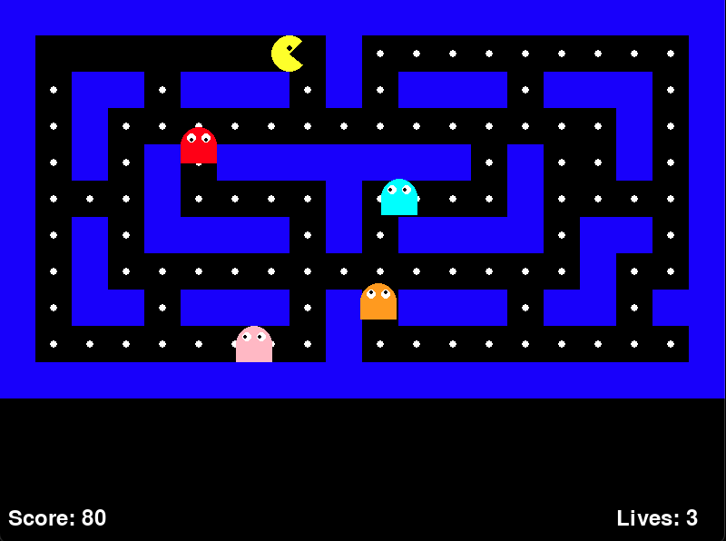

# Simple Pacman Game

A classic Pacman arcade game built with Python and Pygame. Navigate through the maze, collect dots, and avoid the ghosts!




[](https://github.com/codespaces/new?hide_repo_select=true&ref=main&repo=bigevilbeard/SimplePacManGame)

## Features

- Classic Pacman gameplay mechanics
- Animated Pacman character with mouth movement
- Four colorful ghosts with AI movement
- Maze with walls and collectible dots
- Score tracking and lives system
- Game over and win conditions

## Requirements

- Python 3.x
- Pygame

## Installation

### Local Setup

1. Clone this repository:
   ```
   git clone https://github.com/yourusername/pacman-game.git
   cd pacman-game
   ```

2. Install the required dependencies:
   ```
   pip install pygame
   ```

3. Run the game:
   ```
   python pacman_game.py
   ```

### Using GitHub Codespaces

You can run this game directly in your browser using GitHub Codespaces:

1. Click the "Open in GitHub Codespaces" button at the top of this README
2. Wait for the Codespace to initialize
3. Once ready, open a terminal and run:
   ```
   pip install pygame
   python pacman_game.py
   ```

Note: To play the game in Codespaces, you'll need to use the "Simple Browser" or port forwarding if the game uses a web interface. For the standard Pygame version, you may need to use X11 forwarding or VNC to see the graphical output.

## How to Play

- Use the **arrow keys** to control Pacman's movement
- Collect all dots in the maze to win
- Avoid the ghosts - if they catch you, you'll lose a life
- You have 3 lives to complete the game
- Press **ESC** to quit the game
- Press **R** to restart after game over or winning

## How It Works

The game is built using Pygame and consists of several key components:

### Game Structure
- The game uses a grid-based maze represented by a 2D array
- Each cell can be a wall (1) or a path with a dot (0)
- The game runs at 60 FPS with a main loop handling updates and rendering

### Pacman
- Controlled by the player using arrow keys
- Moves through the maze collecting dots
- Features animated mouth opening and closing
- Has collision detection with walls and dots

### Ghosts
- Four ghosts with different colors (Red, Pink, Cyan, Orange)
- Move randomly through the maze
- Change direction when hitting walls
- Cause the player to lose a life upon collision

### Scoring System
- Each dot collected adds 10 points to the score
- Game tracks remaining dots to determine win condition

## Code Structure

- `pacman_game.py`: Main game file containing all game logic
- Game initialization and setup
- Pacman and Ghost classes
- Maze rendering and collision detection
- Game loop and event handling

## Development with GitHub Codespaces

This repository is configured for GitHub Codespaces, which provides a complete, preconfigured development environment in the cloud.

### Benefits of using Codespaces:

- No local setup required - start coding instantly
- Consistent development environment for all contributors
- Run the game directly in the cloud
- Access your development environment from any device with a browser

### Codespaces Configuration

The repository includes a `.devcontainer/devcontainer.json` file that:
- Sets up a Python environment
- Installs Pygame automatically
- Configures VS Code with Python extensions
- Sets up port forwarding

To view the graphical output in Codespaces, you may need to use X11 forwarding or a VNC setup. For advanced users, you can modify the devcontainer configuration to include these capabilities.

## Customization

You can customize various aspects of the game by modifying the constants at the top of the file:
- `WIDTH`, `HEIGHT`: Screen dimensions
- `GRID_SIZE`: Size of each maze cell
- `PACMAN_SPEED`, `GHOST_SPEED`: Movement speeds
- `maze`: Layout of the game maze

## License

This project is licensed under the MIT License - see the LICENSE file for details.

## Acknowledgments

- Inspired by the classic Pacman arcade game
- Built with Pygame, a set of Python modules designed for writing video games
